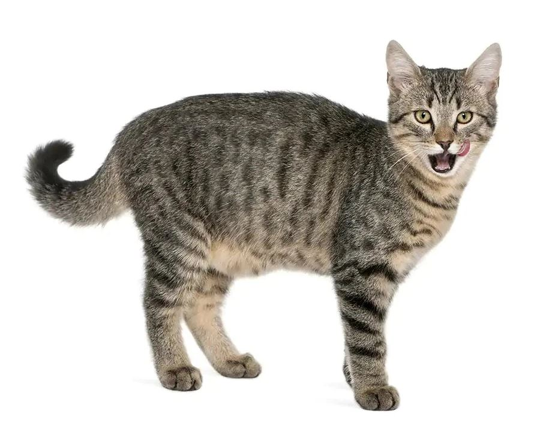

# Onnxruntime Container with IObinding on C++

## Introduction

Despite `.onnx` models having clear benefits in C++ environment, most guides have focused on Python. 
`OnnxContainer` is simple and flexible. Supported execution providers are CPU, CUDA and TensorRT.

`main.cpp` contains example usage of Resnet152 model which you can download [here](https://github.com/onnx/models/tree/main/vision/classification/resnet/model)

**(WARNING: There are some hard-coded WIP compoenents that need to be changed)**

## Features

- [x] IObinding for CUDA and TensorRT
- [ ] Support for input and output tensor size parsing
- [ ] Support for multiplle input/output nodes
- [ ] Further optimizations and speed benchmarks

## How to Use

### Prerequisites
- onnxruntime 1.14.1 or above, with GPU support
- CUDA 11.7 or newer
- CMake, gflags, OpenCV
- (optional) vcpkg

### How to Build (CMake)

- Set onnxruntime installation directory as `-DONNXRUNTIME_ROOTDIR=[YOUR_ONNXRUNTIME_INSTALLATION]` This value is set as `C:/Program Files/onnxruntime` if not explicitly set.
- (optional) Set vcpkg as your cmake toolchain file as `-DCMAKE_TOOLCHAIN_FILE=[YOUR_VCPKG_INSTALLATION]/scripts/buildsystems/vcpkg.cmake`.

```sh
cmake -A x64 -B ./build -S . -DCMAKE_TOOLCHAIN_FILE=[YOUR_VCPKG_INSTALLATION]/scripts/buildsystems/vcpkg.cmake -DONNXRUNTIME_ROOTDIR=[YOUR_ONNXRUNTIME_INSTALLATION]
```

### Example Usage




**Input**

```sh
onnx_example.exe --image_file cat.jpg --provider CPU
```

**Ouput**

```sh
Rank 1 class: "Egyptian cat" with probability: 0.621877
Rank 2 class: "tabby, tabby cat" with probability: 0.324264
Rank 3 class: "tiger cat" with probability: 0.0519
Rank 4 class: "lynx, catamount" with probability: 0.000556309
Rank 5 class: "tiger, Panthera tigris" with probability: 6.72054e-05
```

## Further readings

- [Microsoft's official onnxruntime inference examples on C/C++](https://github.com/microsoft/onnxruntime-inference-examples)